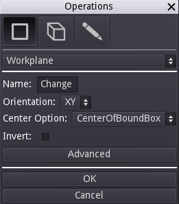
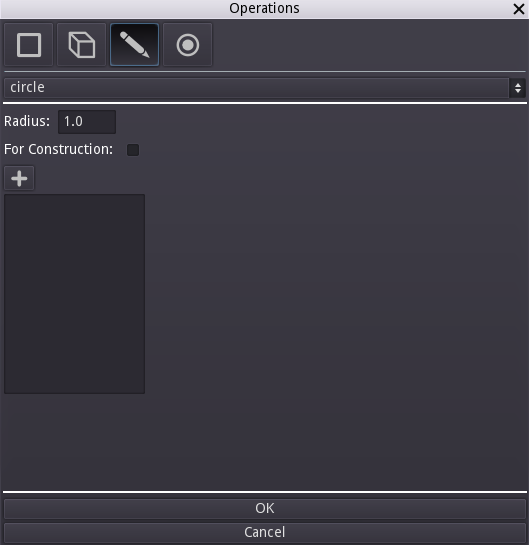
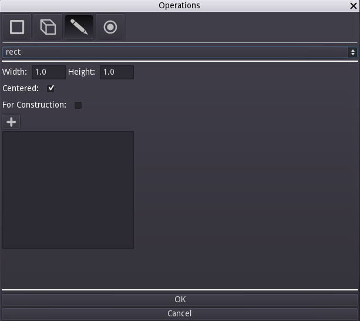
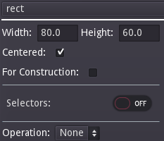
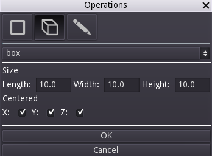
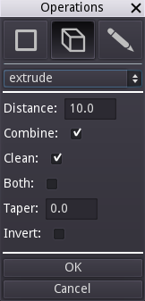
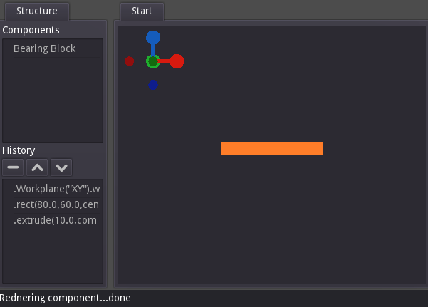

# Bearing Block Tutorial

This is a good starter tutorial which demonstrates some of the core concepts of creating a component with Semblage. It covers selectors, 2D sketching, and 3D operations such as extrusion and holes.

## Base Block

First, create a simple block for the main body of the bearing block.

### Step 1 - Creating the Workplane

Right click on the 3D view to bring up the Operations dialog.

1. Make sure that the first drop down shows `Workplane`, which should be the default. Every component design starts with a base Workplane that everything else is built on.
2. The _Name_ field shows "Change". This should be set to a meaningful and concise name for the component, such as "Bearing Block".
3. The _Orientation_ drop down sets the axes that define the workplane. For instance, _XY_ make the workplane a plane oriented with both the X and Y axes. _XY_ is a safe choice for many desktop manufacturing uses because the bed of a 3D printer or CNC router being in the X and Y axes, and the print head being the Z or "up" axis. We will build the bearing plate "up" the Z axis, much like a 3D printer would print it.
4. _Center Option_ - This option can get a little complicated, but for now the default of _CenterOfBoundBox_ will work fine. This defines the center of the workplane as being the geometric center of the component. The other center options have nuances that we won't cover here.
5. _Invert_ - This defines whether the normal or "up" direction from the workplane is in a positive or negative direction. The default is unchecked, which works well for our purposes and means that the normal will be in a positive direction.
6. _Advanced_ - This button shows another set of controls that allow a user to define a workplane in whatever location and orientation they choose. For our purposes, this is not needed.

Once the settings are correct, click the OK button. Since this is the first time we have added an operation, there may be some delay as the Python subsystem starts up. At this point you should have a semi-transparent representation of the workplane that was just created. If you rotate the view, you will see that there is a plane representing the workplane, and a spike which represents the normal of the workplane. The normal can become important in certain operations like when doing a cut or creating a hole.

### Step 2 - Creating a 2D Sketch on the Workplane

Now that there is a workplane to place geometry on, it's time to create the 2D sketch that will become the base block. Right click to bring up the _Operations_ dialog again, and click the _2D_ button at the top (pencil icon) to select the sketch tool.

By default, the `circle` operation will be selected. In this case we want to create a `rect` (rectangle). Click on the operation dropdown at the top of the dialog that says `circle`, find `rect`, and click it. The `rect` controls should load and the dialog should look like the following.

It is time to define the attributes of the rectangle.

1. Change the _Width_ value to _80.0_. This is the width of the rectangle.
2. Change the _Height_ value to _60.0_. This is the height of the rectangle.
3. Leave _Centered_ checked. When an object is centered, it will have the origin of (0, 0) directly at its center. It is a nice way to keep your component neatly centered.
4. Leave _For Construction_ unchecked. This option is not needed now, but will be used in a later step.
5. _Selectors_ are a very important topic that we will cover when we use them to start placing features on the block.
6. _Operation_ We are going to extrude the rectangle into a solid block in a separate step, but you can use this drop down menu as a shortcut to add the 3D operation. For now we are going to keep things simple.

If the `rect` controls look as they do in the following screenshot, go ahead and click the _OK_ button.

Since Semblage is in alpha some features are missing, and on of those features is 2D visualization in the 3D view. This will make it so that nothing is rendered in the 3D view, although the 2D operation shows up in the _History_ list in the left pane. The 2D sketch is there, and will be used in future operations.

The next operation will be `extrude`. Right click on the 3D view again to bring the _Operations_ dialog back up. Click on the _3D_ button. In most cases this button will be selected by default once a workplane has been created.

Click on the operation drop down at the top of the dialog, select `extrude` from the list, and then set the _Distance_ to _10_ as shown below.

Below is an explanation to each of the `extrude` settings.

1. _Distance_ - The distance that the extrude operation will move through. This will determine the depth dimension of the resulting solid.
2. _Combine_ - Determines whether or not this resulting solid should be combined with other existing solids within this component.
3. _Clean_ - When set, will ask the CAD kernel to clean the resulting solid(s). By default this is checked, and can be unchecked if an extrude results in an invalid solid due to a kernel issue.
4. _Both_ - Will cause the extrude operation to move through the specified distance in both the positive and negative directions at the same time.
5. _Taper_ - Causes the extruded area to increase or decrease as the extrude moves over the distance. A positive taper will cause the area  to decrease and a negative taper will cause the area to increase. Keep in mind that using a taper can make it harder to determine the area of the face at the end of the extrusion.
6. _Invert_ - Checking this will cause the extrusion to move in the opposite direction from the workplane normal.

Once the extrude settings are as shown, click the _OK_ button. The result should look something like this in the main window.

The center hole that the bearing presses into can now be added. To tell CadQuery which face to place the next feature on, we use selectors. Selectors are a flexible way to capture design intent. For instance, if we select the face in the maximum Z axis direction, the furthest face will always be selected, even if steps or other features are added to the component. It makes designs less brittle.

The goal is to eventually have selectors largely determined by what the user selects prior to adding a new operation, but for now the selectors have to be added manually. To add the selector, bring up the Operations dialog (right click) and click the selector button (a dot with a circle around it).

## Center Hole

## Counter-bore Mounting Holes

## Fillet Edges

## (Optional) Alternative Method For Placing Holes
