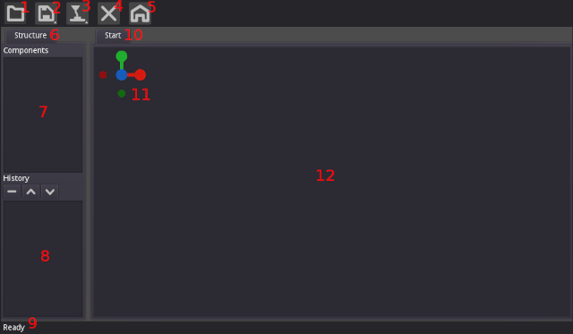
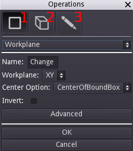
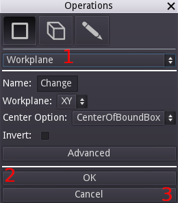
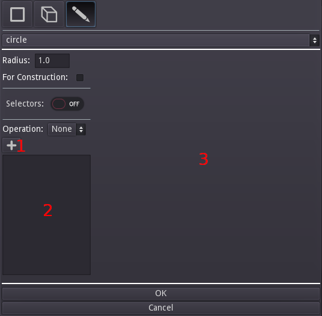
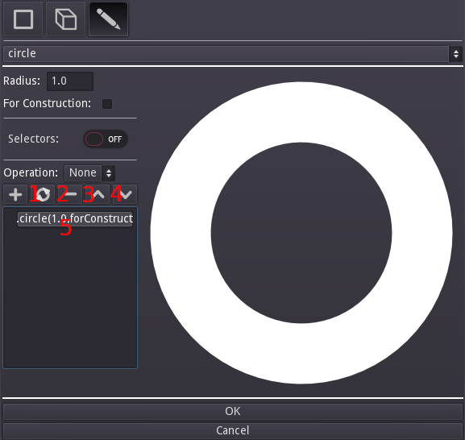

# Usage

## User Interface

Semblage's user interface has several components, and learning where they are and what they do will be important when starting with Semblage. The user interface is kepth intentionally simple, and an effort will be made to keep it simple over tim as more features are added.

Below is a diagram showing the main sections of the user interface.

1. _Open Button_ - Allows a user to open a Semblage component file, which is just a carefully structured CadQuery script. Semblage files are structured in a way that preserves the history, which is the order that operations were added in. Opening a non-Semblage CadQuery file will still work, but no history will be loaded.
2. _Save Button_ - Any button with a triangle in the bottom-right corner will open a submenu. The Save button gives two options: _Save_ and _Save As_. If a component has not been saved yet, clicking the _Save_ option will trigger a _Save As_, which allows the file name to be set for the component. After the file name has been set, clicking _Save_ will simply save the component to the existing file.
3. _Export Button_ - Also referred to as the "Make Button", the icon for this button is a 3D printer head extruding plastic. Clicking this button will display a submenu with a listing of each format that the component can be exported to. Clicking on one of the items will open the export dialog for that format.
4. _Close Button_ - Clicking this button closes the current component and clears the UI so that work on a new component can be started.
5. _Home Button_ - Clicking this button with a component loaded into the 3D view will return the camera view to a standard "home" position. This gives a safe spot to come back to when rotating, panning, and zooming an object.
6. _Structure_ - Sidebar that handles the list _Components_, and the operation _History_ of the currently selected component.
7. _Components_ - List of current components. As of the alpha release only the first component can be selected, but that will change in future releases.
8. _History_ - Holds the series of operations, in order, that created the selected component. Just below the _History_ label there are buttons to manipulate the history and change the order of operations. The buttons allow the user to delete the selected operation (minus icon), move the operation toward the top of the list (up arrow icon), and move the operation down the list (down arrow icon). Double-clicking an entry in this list will allow that entry to be edited in the [Operations Dialog](operations-dialog), which is discussed later.
9. _Status Indicator_ - Used to keep the user updated on what the UI is doing. Examples are _Ready_ for when the interface is fully loaded and ready to use, and _Rendering..._ for when a component is being recomputed and prepared for display.
10. _Document Tab_ - Displays the path and name of the currently open component. Displays _Start_ when the UI first loads.
11. _Rotation Indicator_ - Shows the X (red), Y (green) and Z (blue) axes and their orientation. This indicator mirrors the rotation applied to the component in the 3D view. In the future the indicator ball for each axis will be labelled with its axis letter, and clicking on a ball will snap the 3D view to that orientation. This is very similar to the way this indicator works in Blender.
12. _3D View_ - The 3D render of the component is displayed in this view. The [mouse controls](#mouse-controls) outlined below can be used to rotate, pan and zoom the 3D view.

## Operations Dialog

Right clicking anywhere on the 3D view will display the Operations dialog. This is where the majority of the work of creating components is done. This dialog pops up near the mouse cursor in preparation for when features such as vertices, edges, faces can be selected for an operation. There are three modes that this dialog can operate in with corresponding buttons, and the diagram below highlights each button.

1. _Workplane_ - Used to create a new base workplane for components, or modify the existing workplane with operations such as `rotate` and `translate`. 
2. _3D_ - 3D operations, typically used with a previous 2D operation to create or modify a component.
3. _2D_ - Collection of 2D objects that can be used alone, or in conjunction with a 3D operation later. Clicking this button will also add sketch preview controls, causing the dialog to become wider. The [sketch preview](#sketch-preview) is covered below.

### Common Controls

Besides the mode buttons, there are a few controls that are always available on the operations dialog. Those controls are outlined below.

1. _Operations Drop Down_ - Allows the user to select which operation to apply to the component next. By default, the operation that is shown when creating a new component is _Workplane_, which must be created in order to apply any other operations. Changing this drop down will change which controls are displayed in the middle section of the dialog, above the _OK_ and _Cancel_ buttons.
2. _OK Button_ - Once all parameter controls for the operation have been set, clicking this button will close the dialog and add the operation to the _History_ list, and then trigger a render of the resulting component.
3. _Cancel Button_ - Can be used when it is decided that an operation should not be applied to the component.

### Sketch Controls

When in 2D mode, sketch controls will be added to the dialog, making it wider. These extra controls allow the user to group related 2D operations together into a single _History_ entry. When a 2D operation is added, the result will be displayed in a preview control on the right side of the dialog. At some point this will likely be reworked into a mouse-driven sketch tool, with 2D constraints. The sketch controls are outlined below.

1. _Add Button_ - Clicking this button adds the currently selected operation, configured with the current settings, to the operations list that is discussed next.
2. _Operations List_ - Similar to the _History_ list in the main user interface, this holds each of the 2D operations that have been added by the user. Double-clicking on an entry will load its information into the controls above so that it can be edited (editing is discussed in an upcoming section).
3. _Sketch Preview_ - Shows an SVG preview of the 2D sketch resulting from the operations in the list. This is to aid the user while building more complex sketches, and will be reworked to be more mouse-driven in the future.

Once a 2D operation has been added to the operations list and is selected, a set of new buttons becomes available which allow the user to modify the sketch operations and their order. Each of those additional buttons are outlined below.

1. _Re-Render_ (circle) - After changing the order of 2D operations, clicking this will update the 2D sketch preview to reflect the current 2D operations and their order.
2. _Remove_ (minus) - Clicking this will remove the currently selected 2D sketch operation.
3. _Move Up_ (up arrow) - Moves the selected 2D sketch operation up towards the top of the list.
4. _Move Down (down arrow) - Moves the selected 2D sketch operation down towards the bottom of the list.
5. _Selected_ - Example of an 2D sketch operation highlighted after being selected.

## Mouse Controls

Mouse controls are not configurable at this time.

* _Left Mouse Button_ - Rotate the camera around the component in the 3D view.
* _Mouse Wheel_ - Zoom in and out.
* _Middle Mouse Button_ - Pan the component side to side.
* _Right Mouse Button_ - Open the Operations dialog.

## Workflow

Semblage follows the following general process for creating components.

1. Create a workplane
2. Create a 2D sketch on the workplane (i.e. lines, arcs)
3. Perform a 3D operation on the 2D sketch (i.e. extrude)

There are variations on this theme, such as when a user only wants to create a 2D sketch to export it to DXF or SVG, or when the user wants to create sketches in two orthogonal workplanes to do a sweep operation (not available yet). In general however, this will be the central workflow for most users.

Now that you are familiar with the user interface and basic usage of Sembalge, the [Tutorials](tutorials/index.md) are useful for learning the workflow and modelling techniques.
